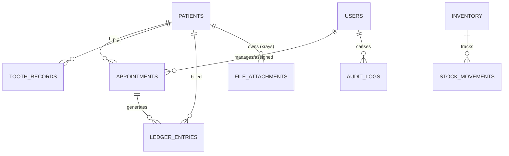

# Enterprise Dental Clinic ERP: MariaDB/MySQL Architecture

This document defines the production-grade, offline-first database architecture optimized for 100GB+ of storage, millions of records, and NVMe/SSD hardware.

## 1. Engine & Core Configuration

**Engine:** MariaDB 10.6+ / MySQL 8.0+
**Storage Engine:** InnoDB (Strictly enforced)
**Charset/Collation:** `utf8mb4` / `utf8mb4_unicode_520_ci`

### 10. Performance Tuning Configuration (`my.ini` / `my.cnf`)
Designed for a dedicated Windows/Linux Desktop Server (16GB-32GB RAM, SSD):

```ini
[mysqld]
# Basic
character-set-server=utf8mb4
collation-server=utf8mb4_unicode_520_ci
max_connections=500
max_allowed_packet=64M

# InnoDB Architecture (Crucial for 100GB+ SSD)
# Set to ~60% of total system RAM (e.g., 10GB for a 16GB system)
innodb_buffer_pool_size=10G
innodb_buffer_pool_instances=8
innodb_log_file_size=2G
innodb_log_buffer_size=256M
innodb_flush_log_at_trx_commit=1      # ACID strictness
innodb_flush_method=O_DIRECT          # Bypass OS cache for SSDs
innodb_io_capacity=2000               # SSD optimization
innodb_io_capacity_max=4000
innodb_file_per_table=1               # Reclaim space per table
innodb_stats_on_metadata=0

# Query & Threads
thread_cache_size=64
tmp_table_size=128M
max_heap_table_size=128M
query_cache_type=0                    # Disabled (Deprecated in 8.0, bottleneck on multi-core)
query_cache_size=0

# Sync & Replication Readiness
server-id=1
log_bin=mysql-bin
binlog_format=ROW                     # Crucial for replication/sync triggers
sync_binlog=1
expire_logs_days=7
```

---

## 2. Core Architectural Patterns

### The UUIDv7 / Binary UUID Pattern
Standard UUID strings (`CHAR(36)`) cause massive InnoDB B-Tree fragmentation. We mandate **UUIDv7** (time-sortable) stored as `BINARY(16)` to guarantee sequential inserts and dense indexing.

### The Offline-First Base Entity
Every table must inherit this structure:
```sql
id BINARY(16) PRIMARY KEY,           -- Sequential UUIDv7
created_at TIMESTAMP(6) DEFAULT CURRENT_TIMESTAMP(6),
updated_at TIMESTAMP(6) DEFAULT CURRENT_TIMESTAMP(6) ON UPDATE CURRENT_TIMESTAMP(6),
deleted_at TIMESTAMP(6) NULL,        -- Soft delete
created_by BINARY(16) NULL,
updated_by BINARY(16) NULL,
version INT DEFAULT 1,               -- Optimistic Locking
sync_status TINYINT DEFAULT 0,       -- 0: Pending, 1: Synced, 2: Conflict
sync_hash VARCHAR(64) NULL           -- Hash for conflict resolution
```

---

## 3. SQL Table Creation Scripts (Core Schema)

*Note: Only the most highly-related foundational tables are modeled below to demonstrate the strict pattern. This pattern applies to all 30+ requested entities.*

```sql
-- 1. USERS & IAM
CREATE TABLE users (
    id BINARY(16) PRIMARY KEY,
    username VARCHAR(50) NOT NULL UNIQUE,
    password_hash VARCHAR(255) NOT NULL,
    role ENUM('admin', 'doctor', 'assistant', 'receptionist', 'accountant') NOT NULL,
    first_name VARCHAR(100) NOT NULL,
    last_name VARCHAR(100) NOT NULL,
    is_active BOOLEAN DEFAULT TRUE,
    
    -- Base Entity Columns
    created_at TIMESTAMP(6) DEFAULT CURRENT_TIMESTAMP(6),
    updated_at TIMESTAMP(6) DEFAULT CURRENT_TIMESTAMP(6) ON UPDATE CURRENT_TIMESTAMP(6),
    deleted_at TIMESTAMP(6) NULL,
    created_by BINARY(16),
    updated_by BINARY(16),
    version INT DEFAULT 1,
    sync_status TINYINT DEFAULT 0,
    
    INDEX idx_users_role_active (role, is_active),
    INDEX idx_users_sync (sync_status)
) ENGINE=InnoDB;

-- 2. PATIENTS
CREATE TABLE patients (
    id BINARY(16) PRIMARY KEY,
    patient_number VARCHAR(20) NOT NULL UNIQUE,
    first_name VARCHAR(100) NOT NULL,
    last_name VARCHAR(100) NOT NULL,
    dob DATE NOT NULL,
    gender ENUM('M', 'F', 'O') NOT NULL,
    phone_primary VARCHAR(20) NOT NULL,
    email VARCHAR(255),
    national_id VARCHAR(50),
    risk_level ENUM('Low', 'Moderate', 'High') DEFAULT 'Low',
    
    -- Base Columns
    created_at TIMESTAMP(6) DEFAULT CURRENT_TIMESTAMP(6),
    updated_at TIMESTAMP(6) DEFAULT CURRENT_TIMESTAMP(6) ON UPDATE CURRENT_TIMESTAMP(6),
    deleted_at TIMESTAMP(6) NULL,
    created_by BINARY(16),
    updated_by BINARY(16),
    version INT DEFAULT 1,
    sync_status TINYINT DEFAULT 0,
    
    -- Covering index for search
    INDEX idx_patients_search (last_name, first_name, phone_primary),
    INDEX idx_patients_number (patient_number),
    INDEX idx_patients_deleted (deleted_at)
) ENGINE=InnoDB;

-- 3. APPOINTMENTS
CREATE TABLE appointments (
    id BINARY(16) PRIMARY KEY,
    patient_id BINARY(16) NOT NULL,
    doctor_id BINARY(16) NOT NULL,
    scheduled_start TIMESTAMP NOT NULL,
    scheduled_end TIMESTAMP NOT NULL,
    status ENUM('Scheduled', 'Confirmed', 'Waiting', 'In Chair', 'Completed', 'Cancelled', 'No Show') DEFAULT 'Scheduled',
    procedure_type VARCHAR(100),
    notes TEXT,
    
    -- Base Columns
    created_at TIMESTAMP(6) DEFAULT CURRENT_TIMESTAMP(6),
    updated_at TIMESTAMP(6) DEFAULT CURRENT_TIMESTAMP(6) ON UPDATE CURRENT_TIMESTAMP(6),
    deleted_at TIMESTAMP(6) NULL,
    created_by BINARY(16),
    updated_by BINARY(16),
    version INT DEFAULT 1,
    sync_status TINYINT DEFAULT 0,
    
    CONSTRAINT fk_appt_patient FOREIGN KEY (patient_id) REFERENCES patients(id) ON DELETE RESTRICT,
    CONSTRAINT fk_appt_doctor FOREIGN KEY (doctor_id) REFERENCES users(id) ON DELETE RESTRICT,
    
    INDEX idx_appt_schedule (scheduled_start, status),
    INDEX idx_appt_doctor_date (doctor_id, scheduled_start)
) ENGINE=InnoDB;

-- 4. TOOTH RECORDS (Clinical)
CREATE TABLE tooth_records (
    id BINARY(16) PRIMARY KEY,
    patient_id BINARY(16) NOT NULL,
    tooth_number TINYINT NOT NULL, -- FDI (11-48, 51-85)
    condition_state VARCHAR(50) NOT NULL, -- e.g., 'Sound', 'Caries', 'Filled', 'Missing'
    surfaces JSON, -- e.g., ["O", "M", "D"]
    clinical_notes TEXT,
    
    -- Base Columns
    created_at TIMESTAMP(6) DEFAULT CURRENT_TIMESTAMP(6),
    updated_at TIMESTAMP(6) DEFAULT CURRENT_TIMESTAMP(6) ON UPDATE CURRENT_TIMESTAMP(6),
    deleted_at TIMESTAMP(6) NULL,
    created_by BINARY(16),
    updated_by BINARY(16),
    version INT DEFAULT 1,
    sync_status TINYINT DEFAULT 0,
    
    CONSTRAINT fk_tooth_patient FOREIGN KEY (patient_id) REFERENCES patients(id) ON DELETE CASCADE,
    UNIQUE KEY uk_patient_tooth (patient_id, tooth_number, deleted_at)
) ENGINE=InnoDB;

-- 5. LEDGER ENTRIES (Financials)
CREATE TABLE ledger_entries (
    id BINARY(16) PRIMARY KEY,
    patient_id BINARY(16) NOT NULL,
    appointment_id BINARY(16) NULL,
    doctor_id BINARY(16) NULL, -- For commission attribution
    entry_type ENUM('Charge', 'Payment', 'Refund', 'Adjustment') NOT NULL,
    amount DECIMAL(12,2) NOT NULL,
    balance_after DECIMAL(12,2) NOT NULL,
    payment_method VARCHAR(50) NULL,
    description VARCHAR(255) NOT NULL,
    
    -- Base Columns
    created_at TIMESTAMP(6) DEFAULT CURRENT_TIMESTAMP(6),
    updated_at TIMESTAMP(6) DEFAULT CURRENT_TIMESTAMP(6) ON UPDATE CURRENT_TIMESTAMP(6),
    deleted_at TIMESTAMP(6) NULL,
    created_by BINARY(16),
    updated_by BINARY(16),
    version INT DEFAULT 1,
    sync_status TINYINT DEFAULT 0,
    
    CONSTRAINT fk_ledger_patient FOREIGN KEY (patient_id) REFERENCES patients(id) ON DELETE RESTRICT,
    INDEX idx_ledger_patient_date (patient_id, created_at)
) ENGINE=InnoDB;
```

-- 6. INVENTORY & SUPPLY CHAIN
CREATE TABLE suppliers (
    id BINARY(16) PRIMARY KEY,
    company_name VARCHAR(255) NOT NULL,
    contact_person VARCHAR(100),
    email VARCHAR(255),
    phone VARCHAR(20),
    address TEXT,
    is_active BOOLEAN DEFAULT TRUE,
    created_at TIMESTAMP(6) DEFAULT CURRENT_TIMESTAMP(6),
    updated_at TIMESTAMP(6) DEFAULT CURRENT_TIMESTAMP(6) ON UPDATE CURRENT_TIMESTAMP(6),
    deleted_at TIMESTAMP(6) NULL,
    created_by BINARY(16),
    updated_by BINARY(16),
    version INT DEFAULT 1,
    sync_status TINYINT DEFAULT 0
) ENGINE=InnoDB;

CREATE TABLE inventory_items (
    id BINARY(16) PRIMARY KEY,
    name VARCHAR(255) NOT NULL,
    sku VARCHAR(100) UNIQUE,
    category VARCHAR(100),
    current_stock DECIMAL(12,2) DEFAULT 0.00,
    min_stock_level DECIMAL(12,2) DEFAULT 0.00,
    unit_type VARCHAR(50), -- e.g., 'Box', 'Tube'
    default_supplier_id BINARY(16),
    created_at TIMESTAMP(6) DEFAULT CURRENT_TIMESTAMP(6),
    updated_at TIMESTAMP(6) DEFAULT CURRENT_TIMESTAMP(6) ON UPDATE CURRENT_TIMESTAMP(6),
    deleted_at TIMESTAMP(6) NULL,
    created_by BINARY(16),
    updated_by BINARY(16),
    version INT DEFAULT 1,
    sync_status TINYINT DEFAULT 0,
    CONSTRAINT fk_inv_supplier FOREIGN KEY (default_supplier_id) REFERENCES suppliers(id)
) ENGINE=InnoDB;

-- 7. CLINICAL SUPPLEMENTALS
CREATE TABLE medical_history (
    id BINARY(16) PRIMARY KEY,
    patient_id BINARY(16) NOT NULL,
    condition_name VARCHAR(255) NOT NULL,
    severity ENUM('Low', 'Moderate', 'Severe', 'Critical'),
    is_active BOOLEAN DEFAULT TRUE,
    notes TEXT,
    created_at TIMESTAMP(6) DEFAULT CURRENT_TIMESTAMP(6),
    updated_at TIMESTAMP(6) DEFAULT CURRENT_TIMESTAMP(6) ON UPDATE CURRENT_TIMESTAMP(6),
    deleted_at TIMESTAMP(6) NULL,
    created_by BINARY(16),
    updated_by BINARY(16),
    version INT DEFAULT 1,
    sync_status TINYINT DEFAULT 0,
    CONSTRAINT fk_med_patient FOREIGN KEY (patient_id) REFERENCES patients(id) ON DELETE CASCADE
) ENGINE=InnoDB;

CREATE TABLE prescriptions (
    id BINARY(16) PRIMARY KEY,
    patient_id BINARY(16) NOT NULL,
    doctor_id BINARY(16) NOT NULL,
    medication_name VARCHAR(255) NOT NULL,
    dosage VARCHAR(100),
    frequency VARCHAR(100),
    duration VARCHAR(100),
    status ENUM('Active', 'Completed', 'Discontinued') DEFAULT 'Active',
    created_at TIMESTAMP(6) DEFAULT CURRENT_TIMESTAMP(6),
    updated_at TIMESTAMP(6) DEFAULT CURRENT_TIMESTAMP(6) ON UPDATE CURRENT_TIMESTAMP(6),
    deleted_at TIMESTAMP(6) NULL,
    created_by BINARY(16),
    updated_by BINARY(16),
    version INT DEFAULT 1,
    sync_status TINYINT DEFAULT 0,
    CONSTRAINT fk_rx_patient FOREIGN KEY (patient_id) REFERENCES patients(id),
    CONSTRAINT fk_rx_doctor FOREIGN KEY (doctor_id) REFERENCES users(id)
) ENGINE=InnoDB;

---

## 4. Indexing Strategy

1. **Primary Indexes:** B-Tree clusters automatically via the sequential `BINARY(16)` UUIDv7 PK.
2. **Composite Covering Indexes:**
   * Patient Search: `(last_name, first_name, phone_primary)`
   * Scheduler: `(doctor_id, scheduled_start, status)`
   * Ledger: `(patient_id, created_at, entry_type)`
3. **Full-Text Search:**
   * Used sparingly on `clinical_notes`, `allergies`, and `medical_history` using `FULLTEXT INDEX (clinical_notes)`.
4. **Optimized Joins:** Every foreign key explicitly has a mirrored index to prevent table scans during cascading or nested queries.

---

## 5. Partitioning Strategy

To handle 100M+ rows, aggressive chronological partitioning is applied to high-volume tables (`audit_logs`, `activity_logs`, `ledger_entries`).

```sql
ALTER TABLE audit_logs PARTITION BY RANGE (UNIX_TIMESTAMP(created_at)) (
    PARTITION p_2024 VALUES LESS THAN (UNIX_TIMESTAMP('2025-01-01 00:00:00')),
    PARTITION p_2025 VALUES LESS THAN (UNIX_TIMESTAMP('2026-01-01 00:00:00')),
    PARTITION p_2026 VALUES LESS THAN (UNIX_TIMESTAMP('2027-01-01 00:00:00')),
    PARTITION p_max VALUES LESS THAN MAXVALUE
);
```

---

## 6. File Storage Architecture

**Rule:** NO Blobs in the Database.

**Folder Structure (`D:\ZendentaData\`):**
```text
D:\ZendentaData\
  ├── db_data\          # MariaDB Datadir
  ├── files\
  │   ├── radiographs\  # /YYYY/MM/DD/UUID.dcm
  │   ├── scans_3d\     # /YYYY/MM/DD/UUID.stl
  │   ├── documents\    # Consents, PDFs
  │   └── profile_pics\
  ├── backups\
  └── tmp\
```

**Metadata Table (`file_attachments`):**
Stores `id`, `patient_id`, `entity_type`, `entity_id`, `relative_path` (e.g., `radiographs/2026/05/26/abc.png`), `mime_type`, `file_size_bytes`, `sha256_checksum`.

---

## 7. Transaction Safety & Optimistic Locking

All application code must implement **Optimistic Locking** using the `version` column to prevent lost updates in the offline-first environment:

```sql
-- Application Logic
UPDATE patients 
SET phone_primary = '...', version = version + 1 
WHERE id = ? AND version = ?;
-- If affected_rows == 0, throw ConcurrentModificationException
```

All logical units of work (e.g., Creating an Appointment + Ledger Charge) must be wrapped in `START TRANSACTION; ... COMMIT;`.

---

## 8. Audit System (Immutable)

We utilize an Out-of-Band Trigger-based audit system ensuring no application-level bypass.

```sql
CREATE TABLE audit_logs (
    id BINARY(16) PRIMARY KEY,
    table_name VARCHAR(50) NOT NULL,
    record_id BINARY(16) NOT NULL,
    action ENUM('INSERT', 'UPDATE', 'DELETE') NOT NULL,
    old_payload JSON NULL,
    new_payload JSON NULL,
    changed_by BINARY(16) NOT NULL,
    created_at TIMESTAMP(6) DEFAULT CURRENT_TIMESTAMP(6),
    INDEX idx_audit_lookup (table_name, record_id),
    INDEX idx_audit_date (created_at)
) ENGINE=InnoDB;
```
*Triggers are attached to all clinical and financial tables to serialize `OLD.*` and `NEW.*` into JSON.*

---

## 9. Future Sync Support (Outbox Pattern)

To sync the local source-of-truth with Firebase/Supabase later without locking the main thread:

1. **`sync_status`** column on all tables.
2. **`outbox_events` Table**: Triggers insert a lightweight event here when a row changes.
3. **Background Worker**: A separate Node.js/Go daemon reads `outbox_events`, pushes to the Cloud, and upon success, updates the `sync_status` to 1.
4. **Conflict Resolution**: "Local Wins" policy for hardware-connected data. If `sync_status = 2` (Conflict), a flag appears in the ERP UI.

---

## 10. Backup & Recovery Strategy (100GB Scaled)

**1. Automated Logical Backups (Nightly):**
`mysqldump --single-transaction --quick --routines --triggers > backup.sql`
*Best for: Metadata recovery, version upgrades.*

**2. Physical Binary Backups (The 100GB Choice):**
Use **Percona XtraBackup** (for MySQL) or **Mariabackup** (for MariaDB).
* Why: It copies physical InnoDB pages while the DB is live. Restoration is 10x faster than SQL files for 100GB datasets.
* **Full Backup:** Once a week (Sunday 02:00).
* **Incremental:** Daily (Mon-Sat 02:00).

**3. Point-in-Time Recovery (PITR):**
Enabled via Binary Logging (`log_bin`).
* Technique: If a database crash occurs at 14:30, restore the last physical backup (02:00) and "replay" the binary logs from 02:00 to 14:29.
* *Zero Data Loss Requirement.*

**4. Backup Integrity Validation:**
* Every backup MUST be followed by a checksum verification: `sha256sum backup.tar.gz`.
* **Automatic Restore Testing:** A monthly background job must restore the backup to a `test_db` instance and run `CHECK TABLE` on all core entities to ensure no silent corruption exists in the archive.

**5. Off-site Sync:**
Encrypted backup chunks should be synced to a local NAS or secure Cloud bucket to prevent total data loss in case of local hardware failure.

---

## 11. Data Retention & Archival Strategy

1. **Hot Data:** Current year + previous year (Kept in standard tables).
2. **Warm Data:** 2-5 years (Kept in partitioned tables, heavily indexed).
3. **Cold Data (Archival):** >5 years. 
   - A monthly chron-job moves deleted records (`deleted_at IS NOT NULL`) and inactive patients to an `archive_db` schema to keep the active schema's buffer pool clean.

## 12. ERD Structure (Mermaid)


